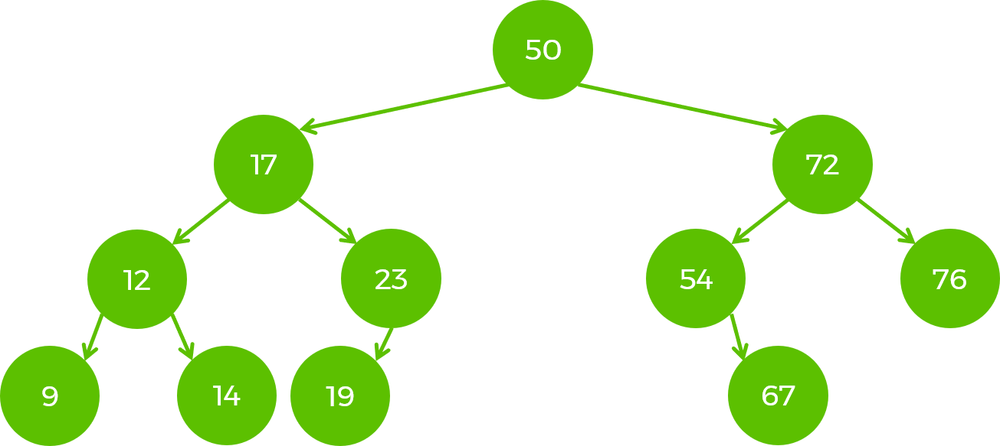

# Binary Search Tree Practice

In this practice session, you will be working on implementing a binary search tree (BST) and solving some related problems. The BST is a node-based data structure where each node has no more than two child nodes. The left child node contains values less than the parent node, and the right child node contains values greater than the parent node.

## Characteristics of BST:

- The root is a special node with no parents.
- A leaf is a node with no child nodes.
- A tree is balanced when the difference in height between the left and right sub-trees of each node is at most 1.
- A balanced tree optimizes searching, inserting, and deleting operations, which can be done in O(logn) time complexity.

### Common operations and their time complexities (in a balanced tree):

- Insert new node: O(logn)
- Search: O(logn)
- Remove a node: O(logn)
- In a non-balanced BST, the performance of some operations may degrade to O(n).

## BST Use Cases:

- Maintaining a sorted list of values where you can quickly add elements and still have them sorted (consider using an array for this purpose, but keep in mind the trade-offs of different data structures).
- Managing a dynamically changing dataset in sorted order, especially for sortable or comparable types of data.

### Before You Begin:

- Gain a better understanding of trees by exploring and experimenting with visualizations in [Visualgo](https://visualgo.net/en/bst).
- Draw a BST and think about the algorithms for inserting, finding, and deleting a node. Consider how you would implement removing a node from the tree.

## Task:

Your task is to implement a binary search tree using the provided skeleton. The unit tests cover the following methods and properties:

- `insert(value): void` - inserts the given value into the tree. If the value already exists, the method does nothing.
- `search(value): boolean` - returns whether the given value exists in the tree.
- `height` - returns the height of the tree.
- `dfsInorder` - returns an array of all values in *inorder* fashion. If implemented correctly, the array should be **naturally sorted**.
- `bfs` - returns an array of all values in breadth-first search order.
- `dfsPreorder` - returns an array of all values in *preorder* fashion.
- `dfsPostorder` - returns an array of all values in *postorder* fashion.

**Do not delete** the `root` property and the `__testSetup` method. They are used for easier testing.

### Advanced Task:

- Implement the `remove(value)` method, which removes the given value from the tree.

  
Very Advanced Task

  

  <i>This task is complicated and challenging. You can try it when you have graduated and want to further improve your skills before interviews.</i>

  - Refactor the tree to be a **balanced** Binary Search Tree. You can approach this problem by learning about AVL trees or Red-Black Trees (or both).
  

### Practice:

To further solidify your understanding and apply your skills, work on the following practice problems:

- [Minimum Absolute Difference in BST](https://leetcode.com/problems/minimum-absolute-difference-in-bst/)  
- [Longest Univalue Path](https://leetcode.com/problems/longest-univalue-path/description/)  
- [Binary Tree Paths](https://leetcode.com/problems/binary-tree-paths/description/)  
- [More](https://leetcode.com/problemset/all/?search=bst)

Take your time to complete the tasks and challenges, and don't hesitate to ask questions if you need any assistance. Happy coding!

---
