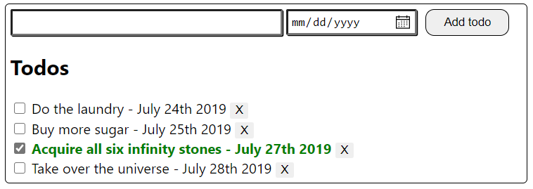
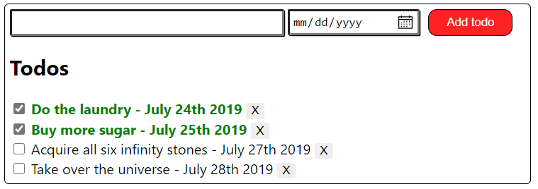

## HTML - Tasks

Create the structure of a TODO app. This app will be extended later on in the course with features, such as **add, remove and mark them as done/not done todos**. Use CSS to add styling of your choice.

1.  Each todo has:

    - Id
    - Name
    - Due date
    - IsDone

1.  Use CSS to make the todo app better looking and feel free to express your creativity.
    - font-family should be `Segoe UI`
    - `:checked` checkbox should have their associated text colored in `green` and `bold`
    - the button should be red with white color on hover

    _Example 1:_

    

    _Example 2:_

    
