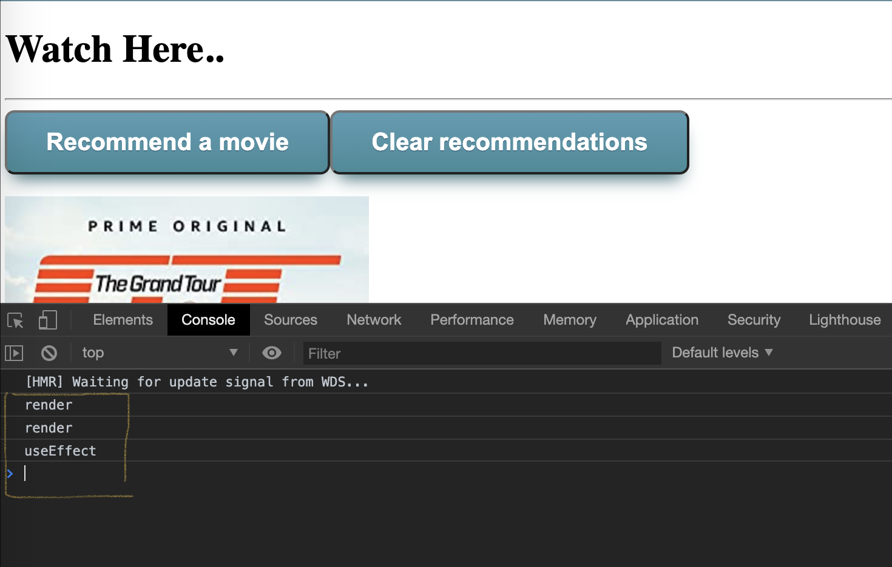

## React Movies Project - useEffect & HTTP

### 1. useEffect Hook
**useEffect** lets you perform side effects inside function components. By default, useEffect will trigger every time the component re-renders. You can split multiple side effects into multiple useEffect calls.

#### Test out how useEffect works:

1. For our testing purposes we'll use the **Header** component and alter it by adding this code:

    ```js
      import { useEffect } from 'react';

      const Header = () => {

        useEffect(() => {
          console.log("useEffect");
        });

        console.log("render");

        return <h1>Watch Here..</h1>;
      };

      export default Header;
    ```

2. Now run the application and let's explain what you see there:



  1. Why is the "render" logged before "useEffect"? 
      > This is because React first updates the DOM, then calls any function passed to useEffect().
  2. Why there sre two "render"s? 
   
      Remember that **create-react-app** loads the main **App** component in [React.StrictMode](https://react.dev/reference/react/StrictMode). 
    
      > Warning: Strict Mode enables the following development-only behaviors:
      > Your components will re-render an extra time to find bugs caused by impure rendering.
      > Your components will re-run Effects an extra time to find bugs caused by missing Effect cleanup.
      > Your components will be checked for usage of deprecated APIs.

### 2. HTTP

Now let's **useEffect** along with **Fetch API** to replace our movies array with real data.

1. Go ahead and generate your free **API key** for the used movies api here - https://www.omdbapi.com/apikey.aspx
   
2. Create a **constants** folder and file and store the **baseUrl** of the api and **apiKey** there:

    ```js
        export const CONSTANTS = {
          baseUrl: 'https://www.omdbapi.com/',
          apiKey: '1591af6' // SENSITIVE DATA! Place your api key here and think about where you can store it more securely
      };
    ```

3. Delete the existing hard-coded movies inside the **Movies** component
   
4. Fetch the movies from the api using the **search endpoint** with arbitrary search term inside an **useEffect** call:

    ```js
      import { CONSTANTS } from '../constants/constants';
      
      ...

      const [movies, setMovies] = useState([]);
      const search = 'amazing';

      useEffect(() => {
        fetch(`${BASE_URL}?apikey=${API_KEY}&s=${search}`)
          .then(response => response.json())
          .then(data => {
            if (data.Response === 'True') {
              setMovies(data.Search);
          }
      }, []);
    ```

*Note: The OMDB API does not provide endpoint for all movie data. So we'll search by default for some word.*

1. Refactor the **MovieDetails** component to mirror the actual properties from the gathered objects (they start with an upper letter):

    ```html
        <div id={props.imdbID} onClick={deleteMovie}>
          
          <div>{props.Title}</div>
          <div>
            Year: {props.Year} | Type: {props.Type}
          </div>
        </div>
    ```

2. **[Optional]** Try to experiment and implement logic for searching!
   1. Add input to enter a search word
   2. Add button to execute the search
   3. Style the button using **withPrettyButtons** component

### 3. Loading and Error state

1. Add a **loading state** to the **Movies** component:

  ```js
      import Loader from '../components/Loader/Loader';

      ...

      const [loading, setLoading] = useState(false);
  ```

2. Before the request rise the loading flag and after it (in the finally block), lower it:
   
  ```js
      useEffect(() => {
      setLoading(true);

      fetch(`${CONSTANTS.baseUrl}?apiKey=${CONSTANTS.apiKey}&s=${search}`)
        .then(response => response.json())
        .then(data => {
          if (data.Response === 'True') {
            setMovies(data.Search);
          }
        })
        .finally(() => setLoading(false));
    }, []);
  ```

3. Go ahead and review the **Loader** component - you can create your own cool one from here https://loading.io/css/:

4. Render the loader conditionally when the loading state is true:

    ```js
        if (loading) {
          return <Loader />;
        }
    ```

5. Start the application and see the loader.

6. Introduce and error state that will behave in almost the same way and render it when an error occurred during the fetching

    ```js
      const [error, setError] = useState(null);

      ...

      const [error, setError] = useState(null);

      ...

      if (error) {
        return <h1 style={{ color: 'Red' }}>{error}</h1>;
      }

      ...
    ```

7. Update **useEffect** to handle API errors. The API will not throw an error but has a special way to give an error information trough a response property:

    ```js
        useEffect(() => {
        setLoading(true);

        fetch(`${CONSTANTS.baseUrl}?apiKey=${CONSTANTS.apiKey}&s=${search}`)
          .then(response => response.json())
          .then(data => {
            if (data.Response === 'True') {
              setMovies(data.Search);
            } else if (data.Response === 'False') {
              setError(data.Error);
            }
          })
          .finally(() => setLoading(false));
      }, []);
    ```
8. Let's try it out! Go ahead and break the API search - try to search for '<>' for example ;)
