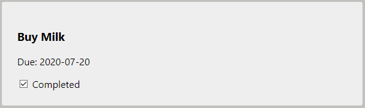
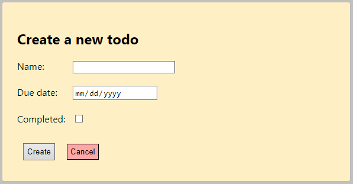

## React ToDo Client

### 1. Description

Seems like the whole front-end team you had been working with to deliver the Todo app got fired and now its your job to do it! Use the Todo API you have created and create a Todo web client with React to consume the API and satisfy the customers.

<br>

### 2. Project information

You will be using React with functional components to build the client app. The activity is continuous and ongoing, and each activity after the first one will build on the previous one refactoring existing code and adding new functionality. You will be provided with the ToDo Server at a later point

<br>

### 3. Goals

Today, we will lay the foundations of this app. The **goal** is to design the main `App` component that will hold all of the `todos` and two other components - the `Header` component that will display the title of the app and the single `Todo` component which will represent each individual todo. 

We will exercise the following:

- creating functional components with React
- detecting and reacting to DOM events
- passing props from parent to child component
- passing data/events from child to parent component
- validating and using props

<br>

### 4. Setting working environment

You are not provided with the template for this activity. You will need to initialize the project on your own

```cmd
npm create vite@latest todos
```

1. Choose React
2. Choose JavaScript with SWC - Speed up your Vite dev server with SWC

<br>

### 5. Available Scripts

In the project directory, you can run:

```bash
  cd todos
  npm install
```

#### `npm run dev`

Runs the app in the development mode.<br />

The page will reload if you make edits.<br />

<br>

### 6. Project structure

The raw template generated by the `vite` script has the following folders:

- `src` - contains the actual app

Right now the `src` folder has a flat structure - you can see that it contains all the files necessary to run the app and add styling, it also contains the top-level `App` component which will serve as a container for all other components once we start creating them. In order to make the code base structure better we will create two folders inside the `src` folder:

- `src/components` will hold our components, and we will create a separate subfolder for every single component
- `src/data` will hold any static (hardcoded) data we will be utilizing

<br>


### 7. Todos data

Later on we will be working with live data - we will be fetching todos from the server and updating them using the REST API, but before we get there - and for the time being - we will be using hardcoded data. Go and create the `todos.js` file in `src/data`

```js
export const todos = [
  {
    id: 0,
    name: 'Buy Milk',
    due: '2023-07-20',
    isDone: true
  },
  {
    id: 1,
    name: 'Learn JavaScript',
    due: '2023-09-01',
    isDone: false
  },
  {
    id: 2,
    name: 'Learn React',
    due: '2023-8-20',
    isDone: false
  },
];

export default todos;
```

` Task: How can you autogenerate the ids?`

**Note:** React-style apps use default exports and imports.

<br>

### 8. App Component

The `App` component will hold the state of the client, which for now will only be the todos array.

```js
import todos from './data/todos';
```

<br>

### 9. Header Component

The `Header` component will only hold the header line of the app, and it should say `Todo App`. You may apply styling as you like.

<br>

### 10. Todo Component

The `Todo` component needs to be a little more complex - it should access props - one of the props should be the individual todo, and the other prop should be the toggle function reference passed by the "parent" `App` component

```js
const Todo = ({ todo, toggle }) => {
  // your component logic here
  // don't forget to call updateTodos
}
```

We need to validate the props using the `'prop-types'` utility. First, you need to install the package and then import it.

```js
import PropTypes from 'prop-types';
```

And then at the bottom of the component file you need to validate the props:

```js
Todo.propTypes = {
  todo: PropTypes.object.isRequired,
  toggle: PropTypes.func.isRequired,
};
```

**Note:** Make sure you add the `propTypes` property directly to the component function `Todo` (this is the equivalent of having a static property in a class).

For each individual todo you need to show the name of the todo, the finish date and the status



When you click on the status checkbox it should change from check to unchecked and vise versa. (Hint: use the `toggle` function passed by the `App` component). At this point we will not actually change the data, but get an alert that we intent to.

<br>

### 11. Putting it all together

Finally, the `App` component should use the `Header` and the `Todo` component, pass each single todo as a prop to a `<Todo />` component inside the returned JSX and also pass a reference to the `toggle` function:

```js
const App = () => {

  const toggle = (id) => alert(`To do ${id} is completed!`);

  return (
    <div>
      <Header />
      <div className="todo-container">
        <Todo todo={todos[0]} toggle={toggle} />
        <Todo todo={todos[1]} toggle={toggle} />
        <Todo todo={todos[2]} toggle={toggle} />
      </div>
    </div>
  );
}
```

### 12. Footer Component

The `Footer` component will only hold the Footer line of the app, and it should say `<p>&copy; 2023 Todos.reactjs.io</p> `. You may apply styling as you like.

Add the **Footer** component at the bottom of the **App** component.

<br>

### 13. The single `Todo` component

Right now we have 3 hardcoded todo items in the app and we are using the following render code in the `App` component to visualize every single todo

```jsx
<div>
  <Header />
  <div className="todo-container">
    <Todo todo={todos[0]} toggle={toggle} />
    <Todo todo={todos[1]} toggle={toggle} />
    <Todo todo={todos[2]} toggle={toggle} />
  </div>
</div>
```

The problem is this will not work for dynamic or arbitrary array size when the data is retrieved from an API or otherwise. We will not know *how many* elements need to be visualized. You need to apply the power of functional programming and use the correct array method to convert the todos to `Todo` components. You can use array methods directly into the `jsx` code

```jsx
<div>
  <Header />
  <div className="todo-container">
    { /* Your JS code here */ }
  </div>
  <Footer />
</div>
```

When you create the component `jsx` code dynamically you need to provide the unique `key` property in the component:

```jsx
<Todo key={unique_key_here} ... />
```

Because of the strict linting rules this will not compile - we need to validate the props using the `'prop-types'` utility. First, you need to import it

```js
import PropTypes from 'prop-types';
```

And then at the bottom of the component file you need to validate the props:

```js
Todo.propTypes = {
  todo: PropTypes.object.isRequired,
  toggle: PropTypes.func.isRequired,
};
```

**Note:** Make sure you add the `propTypes` property directly to the component function `Todo` (this is the equivalent of having a static property in a class).

For each individual todo you need to show the name of the todo, the finish date and the status


<br>

### 14. Render todos list conditionally

Sometimes you may not have todos. We will start loading them dynamically, so we cannot be sure how many are there. If there are no todos render some text saying so. Test your code by passing an empty array of todos.

### 15. The `CreateTodo` component

You need to create the new `CreateTodo` component. It will receive a reference to the `createTodo` function as a prop and call it with the new todo that will be added to the list of todos. Again, we will only state our intention by passing some data back to the parent and alerting it.

In its complete form it should look similar to this (ignore styling)



It should hold the value of each of the three fields - `name`, `due`, `isDone`. Each value should saved inside the component function and the values should be updated when changes are made to each input field.

When you click the `Create` button it should do the following:

- compose the `todo` object
- validate the value of each `todo` property - the `name` should not be empty string, the `due` date should not be an empty string - and if the property is not valid - it should *alert* the error to the user and stop executing the function
  - Research [moment npm package](https://www.npmjs.com/package/moment) to help you format its due date:

    ```js
        const todo = {
        name: '',
        due: moment().format(`YYYY-M-D`),
        isDone: false,
      };
    ```

- call the `createTodo` function referenced passed by the parent component as a prop to the `CreateTodo` component
- when `Cancel` is clicked - alert that no todo is added. 

Don't forget to validate all of the component's props via `propTypes`.

<br>

Add the **CreateTodo** component in the **App** component.